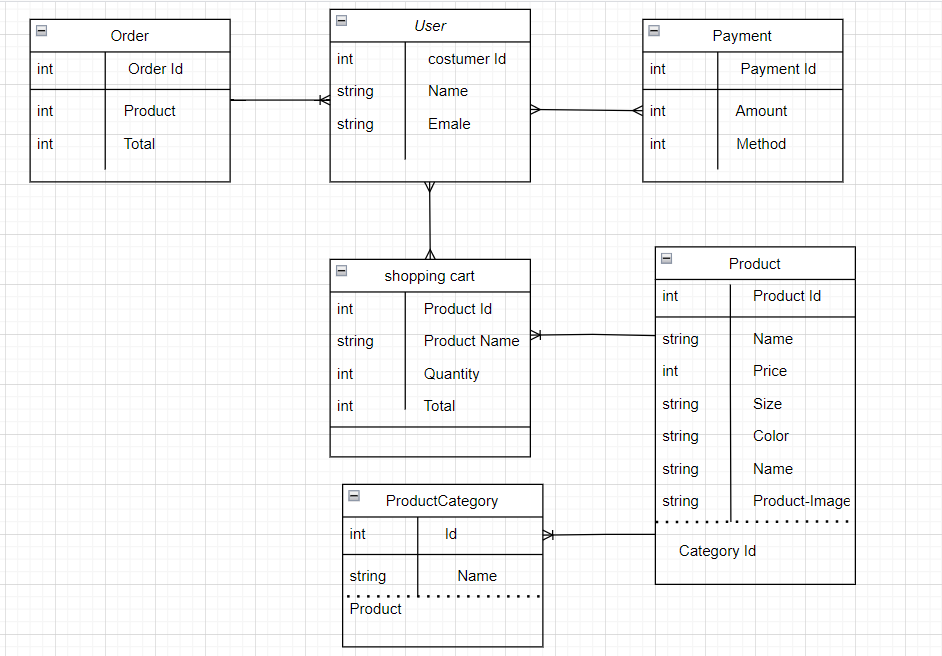
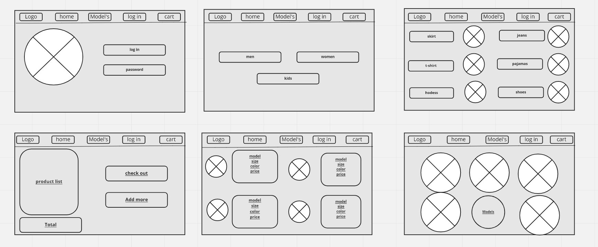

# AWS_E_Commerce
AWS E-Commerce  Selling clothes, shoes and bags for all family members

## User Stories and Tasks

* As an admin user, I would like to have a dashboard where I can see a list of product categories
* As an admin user, I would like to view a detail page for each category so that I can eventually edit its data or delete it
* As an admin user, I would like to see a list of the products assigned to a category on the category details page
* As an admin user, I would like a detail page for each product so that I can eventually edit its data or delete it

* As an administrator I would like add and save a new category so that I can expand my product lines
* As an administrator I would like add and save a new product so that I can expand my inventory
* As an administrator I would like to associate a product to a category so that my users can more easily browse our inventory
* As an administrator I would like to be able to delete products and categories as needed
* As an administrator I would like to be able to edit/modify categories so that I can change my storefront structure in real time
* As an administrator I would like to be able to edit/modify products so that I can change my inventory in real time
---
## ERD 

---
## Wireframe

